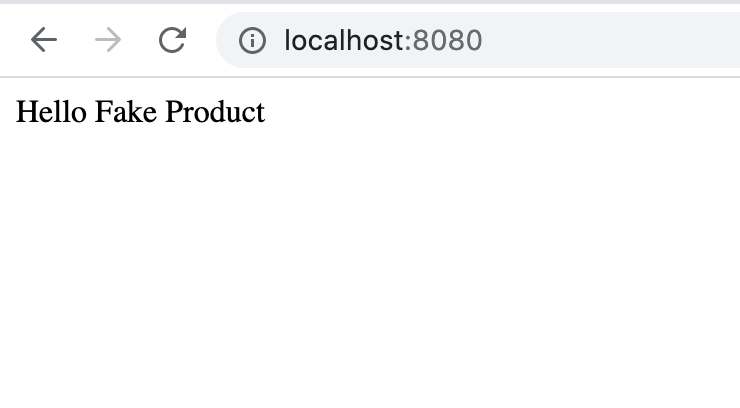
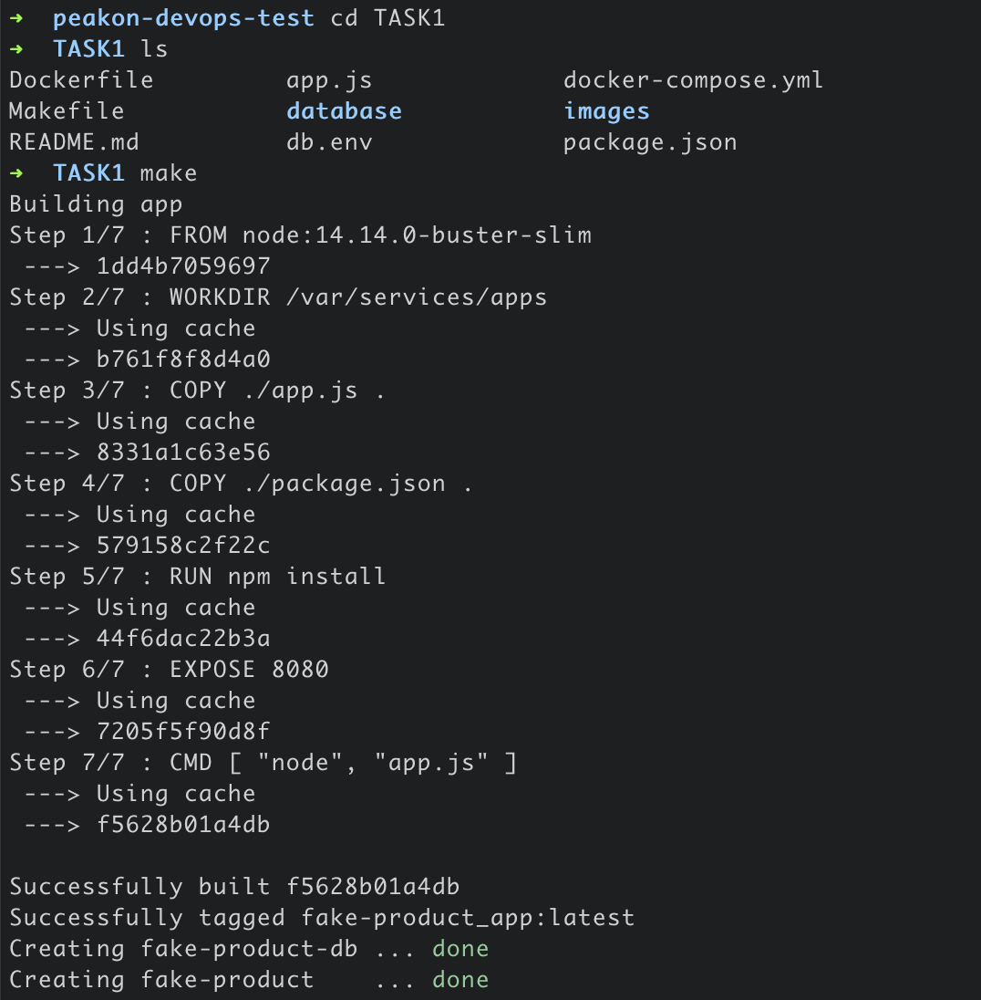
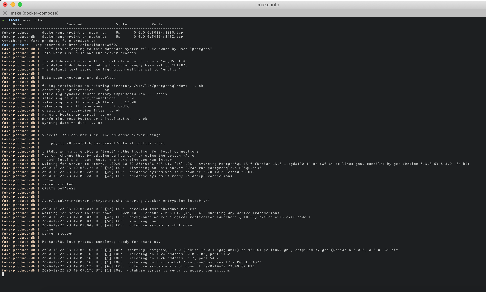

# Task 1 : Containerize app using docker/docker-compose
## How to Apply Terraform Changes?
To simplify the execution of docker commands, I am using a tool called `make`. If you are not familiar with make please read it here: https://formulae.brew.sh/formula/make. Before you start an application please make sure `docker`, `docker-compose` and `make` is installed.
```
# cd peakon-devops-test/TASK1
# make build
# make info
# make stop
```
- build : Build the docker image and start the app using `docker-compose`.
- info: A brief overview of running app and `docker-compose logs`.
- stop: To stop the running container and remove the container.
## Status
● Docker using the official node docker image - `Done`
 
● Docker postgres DB using the official postgres docker image - `Done`
 
● They should be able to talk to one another, even if we’re not using the DB just yet - `Done`
 
● Run `docker-compose up`, have an app server + db running, and see “Hello Fake - `Done`
Product” when they visit http://localhost:8080

● The below example code should be used as the basis of the app - `Done`








# Questions to think about

● How would you test this application?
```
Different types of tests like unit test, sanity test, smoke test and performance testing can be performed as per your need. During build or after deployment using automated tools. But to keep it simple you can also perform a simple `curl http://localhost:8080` to test if your application is up or not. 
```

● How would you deploy this application
```
docker-compose can be used with a single server or on a swarm cluster to deploy your app. however there are other methods as well like using jenkins pipeline or teamcity build to deploy your app and run it on Amazon ECS or EKS. It depends a lot on what tool you want to use and how much you feel comfortable with that tool.
```

● How would you manage configurations for secrets (ie. the DB password)
```
Currently due to time limitation i put credentials in `.env` file. This file can be encrypted using gpg to store it in code securely or using a tool like `https://github.com/StackExchange/blackbox`. However for production I suggest using a proper secret manager like AWS KMS or Hashicorp vault.
```
 