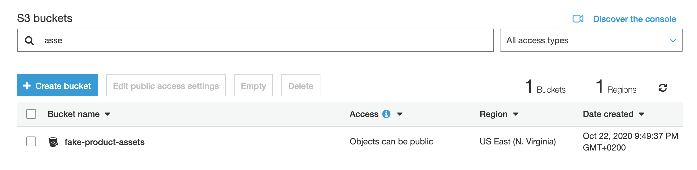

# Task 2 : Infrastructure as code using terraform

## How to Apply Terraform Changes?

`peakon-devops-test/TASK2` has two folders `infra` and `local`. Local creates s3 bucket with dynamodb table which is required to store terraform state remotely in s3 bucket. Before applying changes please make sure you have correct versions and you must configure aws profile with name `test-2020` for this code to work. 

```
# terraform --version
Terraform v0.12.28
+ provider.aws v3.11.0

# cd peakon-devops-test/TASK2/local
# terraform init && terraform plan -out planform
# terraform apply planform

# cd peakon-devops-test/TASK2/infra
# terraform init && terraform plan -out planform
# terraform apply planform

```
### Note: If you face any issue while applying terraform related to bucket, please change the name as it has to be unique.


# Status

## S3
- A single bucket called “fake-product-assets” - `Done`
  

 
## VPC
- Two VPCs - `Done`
- All of the other requirements (subnets, security groups, etc) - `Done`
- You don’t need to create any NAT Gateway or Internet Gateway - `Done`


 
## IAM
- Two users named “emma” and “liam” - `Done`
- One system user named “fake-product” - `Done`


 
# Questions to think about
● What type of security concerns do you have around the VPC?
```
VPC itself offers many options to secure the infrastructure. However you have to keep following things in mind before the implementation.

- Inbound and outbound traffic from VPC.
- Traffic routes between subnets.
- Configuration of Route tables.
- Understanding of traffic for Public and Private Subnets.
- VPC Endpoint for exposing private apps or services.
```
 
● What questions do you have about the 2 users that have full admin access?
```
As a standard practice, Full admin access should not be given to employees, However if these users are cloud admin or in a similar role where they need access its recommended to use 2FA for admin or root accounts. For normal employees you should define policy with limited access.
```

● What security precautions would you take for system users vs. human users?
```
Normally human users are more interactive where you can implement policies for password complexities, 2 factor authentication and rotation. System users are often left in shadows, it's important you store system users credentials somewhere safe with proper procedure of rotations and it should not be shared with employees.
```
